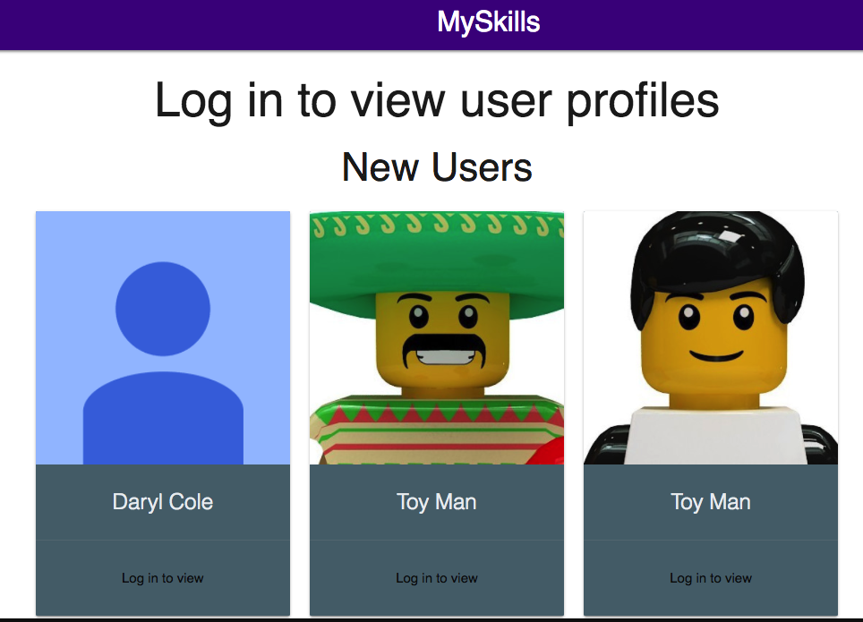
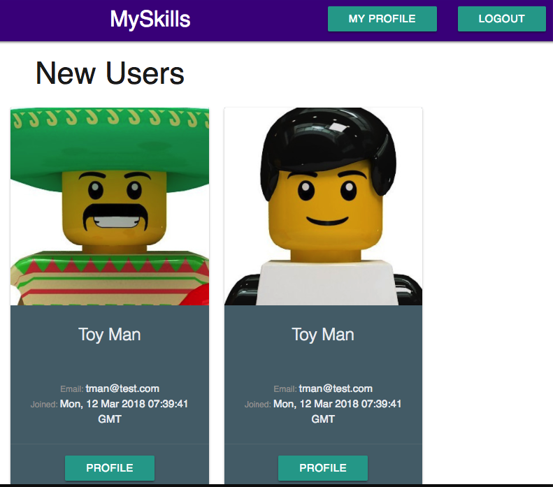
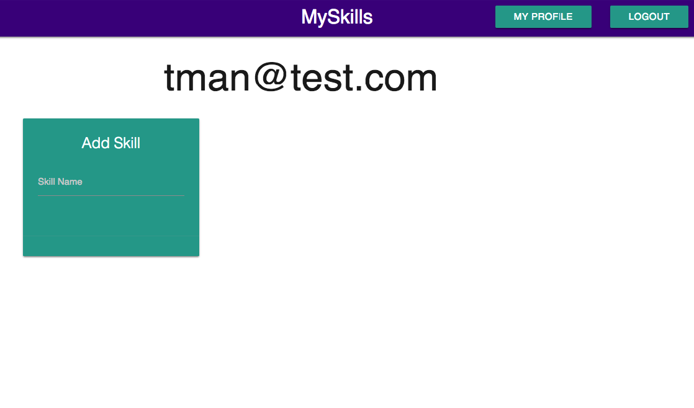
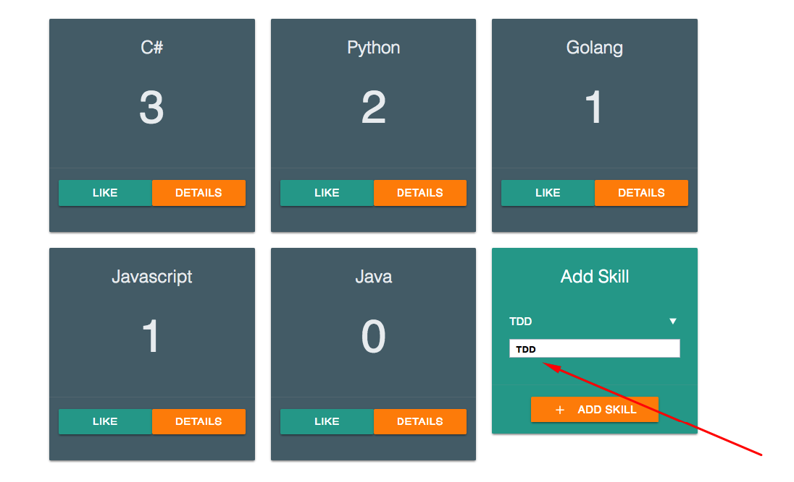
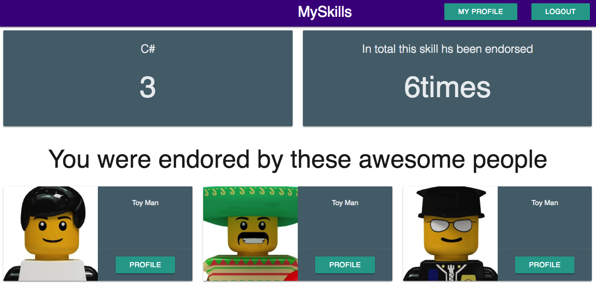

# MySkills

This is a small full stack application I made for a challenge. It allows a user to log in and add skills to their profile. They can also view other users profiles and endorse their skills. Similar to how you can on a site like Wantedly or Linkedin.

You can find the hosted application here

http://ec2-13-231-231-46.ap-northeast-1.compute.amazonaws.com/

## Backend

The backend was written in python flask and is connected to a postgres database. The backend is written as a RESTful api that returns serialized JSON when queried.

Login is handled by Google OAuth.

## Frontend

The frontend is written in React. I used [Materialize](materializecss.com) for styling.

## Overview

## Landing page

The landing page shows the 3 most recent users based on the account creation date. The 3 top users based on total endorsements and the 3 most endorsed skills based on total endorsements.

User cannot view any profiles until they log in. Login button is located at the top right of the screen.

If the user is logged in the new user and top users cards will contain a link to that users profile. The top bar will also contain a link that will take the user to their profile.

## User Profile

When a user is on their profile they can add a skill by typing the skill name into the input field in the green card. Adding a skill automatically endorses it.

When a user is on the profile of another user hey can add a skill by typing the skill name into the input field in the green card. Adding a skill automatically endorses it. They can also endorse any other of the skills if they have not already endorsed it.

## Skill Details

Each skill card also has a "details" button which will take the user to page showing who has endorsed the skill and how many times that skill has been endorsed across the application based on total endorsements.

## Future Considerations

- Introduce redux. I implement some of the same api calls in multiple locations. I would like to add redux to this project to clean up the components.

- Allow a user to delete a skill and un-endorse a skill. This is not currently possible in the app. 

- Have better validation on backend to make sure a user is signed in before returning data.
